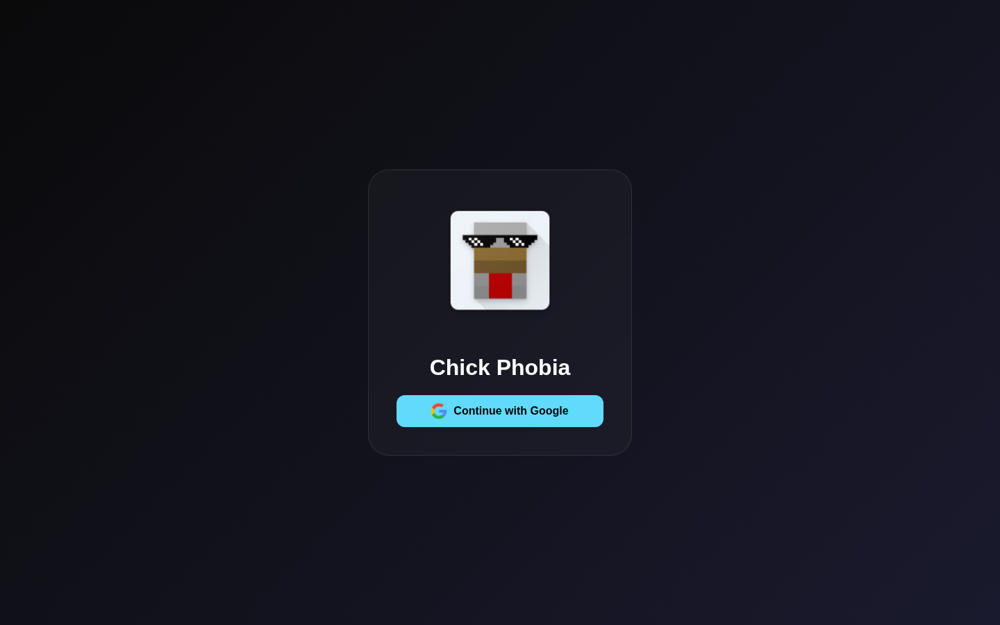

# chick-phobia

<p align="center">
  
</p>

A chat website built with React and Capacitor. Firebase and Cloudinary handle the data and media (database, auth, storage), with JavaScript for both the frontend and backend.

<p align="center">
  
</p>

## Stack

- **Frontend:** React (JavaScript/TypeScript)
- **Backend:** Firebase + Cloudinary
- **Mobile shell:** Capacitor

## Getting started

```bash
npm install
npm run dev
```

## License

See [LICENSE](LICENSE) for details.